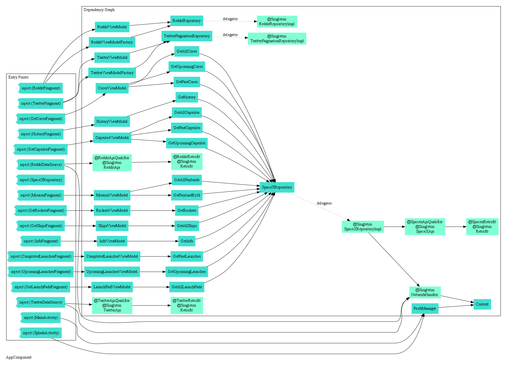

## SpaceX application.

Kotlin, AndroidX, Retrofit, Gson, Coroutines, Koin/Dagger, Timber, Navigation, Pagination, LiveData, ViewModel, ThreeTenAbp.

The whole UI was inspired by [SpaceX Companion](https://play.google.com/store/apps/details?id=nl.studionoorderlicht.spacex&hl=en).

### FYI:
1. DI usage: Kodein -> Koin -> Dagger2

#### Used APIs:
+ [SpaceX API](https://github.com/r-spacex/SpaceX-API)
+ [Twitter API](https://developer.twitter.com/en/docs/api-reference-index)
+ [Reddit API](https://www.reddit.com/dev/api/)

#### Thanks to: 
1. Phil Olson for [twitter oauth 1.0](https://gist.github.com/polson/227e1a039a09f2728163bf7235990178)
2. Fernando Cejas for [interesting architecture features, such as Either, UseCase](https://fernandocejas.com/2018/05/07/architecting-android-reloaded/)
3. CodingWithMitch for [SearchView and RecyclerView](https://codingwithmitch.com/blog/filtering-recyclerview-searchview/)
4. [Spinner items customization](https://android--code.blogspot.com/2015/08/android-spinner-text-color.html)
5. [Safe click listener](https://medium.com/@simonkarmy2004/solving-android-multiple-clicks-problem-kotlin-b99c06135da0)

### Dagger graph by [Scabbard](https://github.com/arunkumar9t2/scabbard)

